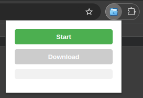

<br />
<p align="center">
  <a href="https://github.com/Far4Ru/save-resources-extension/releases" target="blank">
    
  </a>
  <h2 align="center" style="font-weight: 600">Save Resources Extension (Chrome)</h2>
</p>

Chrome extension for downloading webpack bundles, TypeScript sources, and associated assets while preserving the original directory structure.



## Key Features

- Downloads complete webpack bundles from Sources tab
- Retrieves original `.ts` files from sourcemaps
- Captures referenced assets (images, fonts, CSS)
- Preserves full directory hierarchy

## Installation

### From pre-built package

1. Download the latest release from [Releases page](https://github.com/Far4Ru/save-resources-extension/releases)
2. Unzip the package
3. In Chrome, go to `chrome://extensions/`
4. Enable "Developer mode" (toggle in top right)
5. Click "Load unpacked" and select the `build` folder from the unzipped package

### For developers

Prerequisites: Node.js v18 and npm installed

```bash
# Clone the repository
git clone https://github.com/Far4Ru/save-resources-extension

# Install dependencies
npm install

# Build version
npm run build
```

Production builds output to `/build`.
